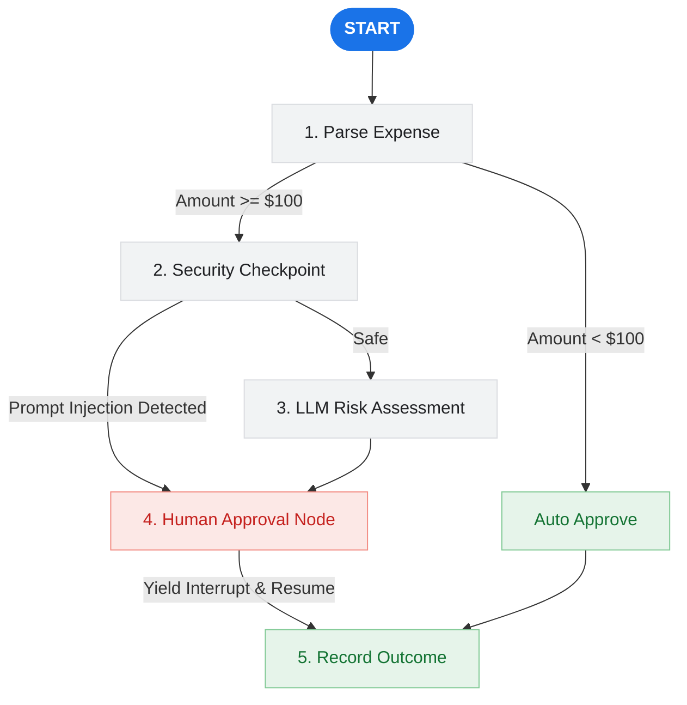

# 💸 Ambient Expense Agent

An intelligent, production-ready AI agent workflow built with the Google **Agent Development Kit (ADK)**. This agent automates the ingestion, security screening, risk assessment, and approval process of corporate expense reports with built-in **Human-in-the-Loop (HITL)** support.

---

## 🌟 Key Features

*   🤖 **Dual Agent Architecture**: Includes both a simple boilerplate assistant and a fully featured automated expense auditor workflow.
*   🔒 **Automated Security Guardrails**: Scrubs personal identifiable information (PII) like SSNs and credit cards, and flags prompt injection attempts to protect core LLM prompt integrity.
*   🧠 **LLM-Based Risk Analysis**: Evaluates expense details for potential policy violations or anomalies using **Gemini**.
*   👥 **Human-in-the-Loop (HITL)**: Automatically pauses execution when an expense needs review and resumes processing seamlessly upon receiving approval input.
*   ⚡ **FastAPI Integration**: Serves the agent playground and handles Pub/Sub events or HTTP webhooks for event-driven orchestration.
*   📊 **Local State & Observability**: Manages session state via SQLite and is pre-wired for Google Cloud Operations Suite telemetry.

---

## 🗺️ Agent Workflow Architecture

The core expense auditing workflow follows a structured sequence of checks and gates:



---

## 📂 Project Structure

```
ambient-expense-agent/
├── expense_agent/         # Primary automated auditing workflow
│   ├── agent.py               # Workflow graph nodes, security schemas & graph
│   ├── service_app.py         # FastAPI backend, SQLite setup, Pub/Sub webhook
│   └── config.py              # Model names and validation thresholds
├── app/                   # Scaffolded basic playground assistant
│   └── agent.py               # Simple weather & time agent logic
├── tests/                 # Unit, integration, and load tests
├── deployment/            # Terraform configurations (Single-project Setup)
├── GEMINI.md              # AI-assisted development instructions
└── pyproject.toml         # Python workspace dependencies (uv)
```

---

## 🚀 Quick Start

### Prerequisites

Ensure you have the following installed on your system:
*   [**uv**](https://docs.astral.sh/uv/getting-started/installation/) — Fast Python package and project manager.
*   [**google-agents-cli**](https://github.com/google/agents-cli) — Command Line Tool for ADK development.
*   [**Google Cloud SDK**](https://cloud.google.com/sdk/docs/install) — For GCP authentication and services.

### Installation

1. Install the CLI and download necessary tools/skills:
    ```bash
    uvx google-agents-cli setup
    ```

2. Install python dependencies locally:
    ```bash
    agents-cli install
    ```

3. Launch the interactive local playground UI to test the agent:
    ```bash
    agents-cli playground
    ```

---

## 🛠️ CLI Reference

Here is a quick overview of useful developer commands:

| Command | Category | Description |
| :--- | :--- | :--- |
| `agents-cli playground` | Development | Start a local web app with the interactive UI |
| `agents-cli lint` | Quality | Lint the codebase for formatting and type issues |
| `uv run pytest tests/` | Testing | Run all unit and integration tests |
| `agents-cli eval generate` | Evaluation | Run agent on dataset and output evaluation traces |
| `agents-cli eval grade` | Evaluation | Run LLM-as-judge graders on the output traces |
| `agents-cli eval compare` | Evaluation | Diff current evaluation grades against a prior run |
| `agents-cli deploy` | Deployment | Deploy the agent app to Vertex AI Agent Runtime |

---

## 🔒 Security & Safety Controls

> [!IMPORTANT]
> The security checkpoint node (`security_checkpoint`) runs automatically before submitting details to the LLM to prevent data leaks and prompt manipulation.

*   **PII Scrubbing**: Automatically replaces SSNs with `[REDACTED_SSN]` and Credit Cards with `[REDACTED_CC]` in the description.
*   **Prompt Injection Detection**: Scans for override keywords (like *"ignore prior instructions"*, *"force approval"*, etc.). If detected, it bypasses the LLM analysis entirely and escalates directly to human review with a `⚠️ SECURITY WARNING`.
